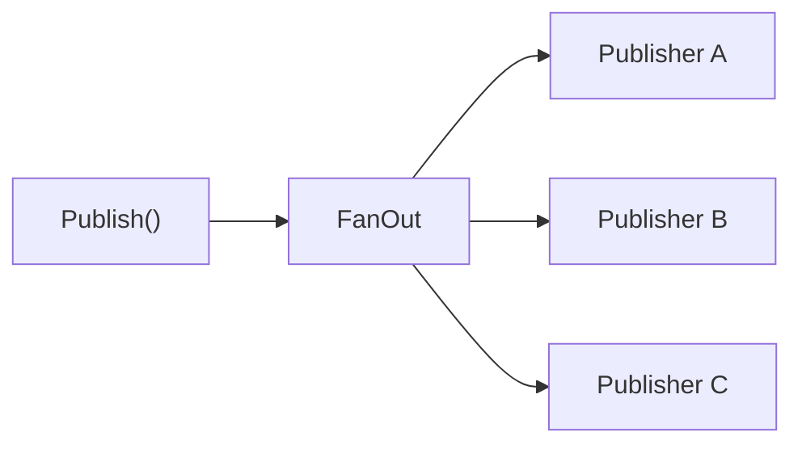
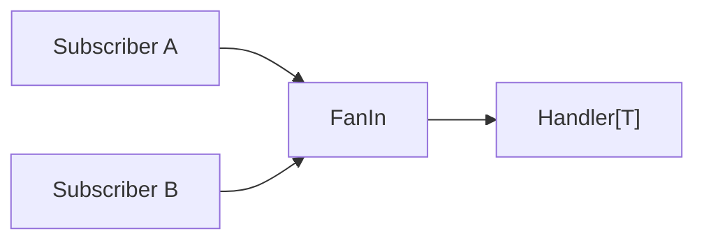
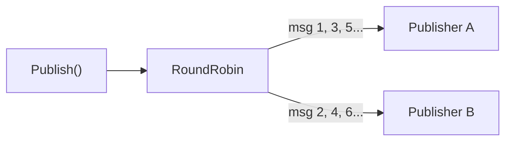

# Fan-Out, Fan-In, and Round-Robin

goflux provides three distribution primitives for wiring publishers and subscribers together.

## Fan-Out: Broadcast to Multiple Publishers

`goflux.FanOut` creates a `Publisher[T]` that forwards every `Publish` call to all inner publishers.



### Best-Effort Mode (Default)

In best-effort mode, `FanOut` publishes to every publisher even if some fail. Errors from failing publishers are joined together.

```go
package main

import (
	"context"
	"errors"
	"fmt"

	"github.com/foomo/goflux"
)

type Event struct {
	ID   string
	Name string
}

// collectPublisher records every published message.
type collectPublisher[T any] struct {
	msgs []T
}

func (p *collectPublisher[T]) Publish(_ context.Context, _ string, v T) error {
	p.msgs = append(p.msgs, v)
	return nil
}
func (p *collectPublisher[T]) Close() error { return nil }

// failPublisher always returns an error.
type failPublisher[T any] struct{ err error }

func (p *failPublisher[T]) Publish(context.Context, string, T) error { return p.err }
func (p *failPublisher[T]) Close() error                             { return nil }

func main() {
	ctx := context.Background()

	good := &collectPublisher[Event]{}
	bad := &failPublisher[Event]{err: errors.New("down")}

	pub := goflux.FanOut[Event]([]goflux.Publisher[Event]{bad, good})

	err := pub.Publish(ctx, "events", Event{ID: "1", Name: "hello"})
	fmt.Println("error:", err)
	fmt.Println("good received:", good.msgs)
	// Output:
	// error: down
	// good received: [{1 hello}]
}
```

The healthy publisher still receives the message even though the failing one returned an error. The combined error is returned to the caller.

### All-or-Nothing Mode

With `WithFanOutAllOrNothing`, the first error aborts immediately -- remaining publishers are not called.

```go
bad := &failPublisher[Event]{err: errors.New("down")}
good := &collectPublisher[Event]{}

pub := goflux.FanOut[Event](
	[]goflux.Publisher[Event]{bad, good},
	goflux.WithFanOutAllOrNothing[Event](),
)

err := pub.Publish(ctx, "events", Event{ID: "1", Name: "hello"})
fmt.Println("error:", err)
fmt.Println("good received:", good.msgs)
// Output:
// error: down
// good received: []
```

The `good` publisher received nothing because `bad` failed first.

## Fan-In: Merge Multiple Subscribers

`goflux.FanIn` creates a `Subscriber[T]` that subscribes to the same subject on all inner subscribers and dispatches every message to a single handler.



```go
package main

import (
	"context"
	"fmt"
	"sort"
	"sync"
	"time"

	"github.com/foomo/goflux"
	_chan "github.com/foomo/goflux/chan"
)

type Event struct {
	ID   string
	Name string
}

func main() {
	ctx, cancel := context.WithCancel(context.Background())
	defer cancel()

	// Two independent source buses.
	busA := _chan.NewBus[Event]()
	pubA := _chan.NewPublisher(busA)

	subA, _ := _chan.NewSubscriber(busA, 1)

	busB := _chan.NewBus[Event]()
	pubB := _chan.NewPublisher(busB)

	subB, _ := _chan.NewSubscriber(busB, 1)

	// Merge both subscribers into one.
	merged := goflux.FanIn[Event](subA, subB)

	var (
		mu       sync.Mutex
		received []string
	)

	done := make(chan struct{})
	go func() {
		_ = merged.Subscribe(ctx, "events", func(_ context.Context, msg goflux.Message[Event]) error {
			mu.Lock()
			received = append(received, msg.Payload.Name)
			if len(received) == 2 {
				close(done)
			}
			mu.Unlock()
			return nil
		})
	}()

	time.Sleep(10 * time.Millisecond)

	_ = pubA.Publish(ctx, "events", Event{ID: "1", Name: "from-a"})
	_ = pubB.Publish(ctx, "events", Event{ID: "2", Name: "from-b"})

	<-done

	mu.Lock()
	sort.Strings(received)
	for _, r := range received {
		fmt.Println(r)
	}
	mu.Unlock()
	// Output:
	// from-a
	// from-b
}
```

`FanIn` subscribes to each inner subscriber in its own goroutine and blocks until all of them complete. The handler is shared, so it must be safe for concurrent use.

## Round-Robin: Load Distribution

`goflux.RoundRobin` creates a `Publisher[T]` that distributes each `Publish` call to a single inner publisher, cycling through them in order.



```go
package main

import (
	"context"
	"fmt"

	"github.com/foomo/goflux"
)

type Event struct {
	ID   string
	Name string
}

type collectPublisher[T any] struct {
	msgs []T
}

func (p *collectPublisher[T]) Publish(_ context.Context, _ string, v T) error {
	p.msgs = append(p.msgs, v)
	return nil
}
func (p *collectPublisher[T]) Close() error { return nil }

func main() {
	ctx := context.Background()

	a := &collectPublisher[Event]{}
	b := &collectPublisher[Event]{}

	pub := goflux.RoundRobin[Event](a, b)

	_ = pub.Publish(ctx, "events", Event{ID: "1", Name: "first"})
	_ = pub.Publish(ctx, "events", Event{ID: "2", Name: "second"})
	_ = pub.Publish(ctx, "events", Event{ID: "3", Name: "third"})

	fmt.Println("a:", a.msgs)
	fmt.Println("b:", b.msgs)
	// Output:
	// a: [{1 first} {3 third}]
	// b: [{2 second}]
}
```

`RoundRobin` uses an atomic counter, so it is safe for concurrent use. `Close` is a no-op -- the caller owns the inner publishers.

## Comparison

| Pattern | Type | Behaviour |
|---------|------|-----------|
| `FanOut` | Publisher | Every message goes to **all** inner publishers |
| `FanIn` | Subscriber | Messages from **all** inner subscribers go to **one** handler |
| `RoundRobin` | Publisher | Each message goes to **one** inner publisher, cycling in order |
