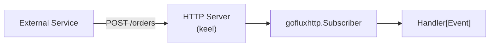

# HTTP Webhook

The `http/` transport turns goflux into a webhook system. The publisher POSTs JSON to `{baseURL}/{subject}`, and the subscriber exposes an `http.HandlerFunc` that decodes incoming requests and dispatches them to a `Handler[T]`.

## Self-Contained Example

This example uses `httptest` to run a full publish/subscribe cycle without any external server.

```go
package main

import (
	"context"
	"fmt"
	"net/http"
	"net/http/httptest"

	"github.com/foomo/goencode/json/v1"
	"github.com/foomo/goflux"
	gofluxhttp "github.com/foomo/goflux/http"
)

type Event struct {
	ID   string `json:"id"`
	Name string `json:"name"`
}

func main() {
	ctx := context.Background()
	codec := json.NewCodec[Event]()

	done := make(chan struct{})

	// Create the HTTP subscriber.
	sub := gofluxhttp.NewSubscriber[Event](codec)

	// Get the http.HandlerFunc for a specific subject.
	handler := sub.Handler("events", func(_ context.Context, msg goflux.Message[Event]) error {
		fmt.Println(msg.Subject, msg.Payload.ID, msg.Payload.Name)
		close(done)
		return nil
	})

	// Start a test server using the handler.
	mux := http.NewServeMux()
	mux.Handle("/events", handler)

	srv := httptest.NewServer(mux)
	defer srv.Close()

	// Create the HTTP publisher pointing at the test server.
	pub := gofluxhttp.NewPublisher[Event](srv.URL, codec, srv.Client())

	// Publish a message — it POSTs to {baseURL}/events.
	if err := pub.Publish(ctx, "events", Event{ID: "1", Name: "order-created"}); err != nil {
		panic(err)
	}

	<-done
	// Output: events 1 order-created
}
```

Key points:

- `NewPublisher` POSTs to `{baseURL}/{subject}`. The subject becomes the URL path.
- `NewSubscriber` does not start its own HTTP server. It exposes route handlers that you mount on any `http.ServeMux` or framework router.
- `Handler()` returns a standard `http.HandlerFunc` for a given subject -- mount it however you like.
- `Subscribe()` registers the handler on the subscriber's internal mux and blocks until the context is cancelled.

## Response Codes

The HTTP subscriber responds with:

| Code | Meaning |
|------|---------|
| `204 No Content` | Handler succeeded |
| `400 Bad Request` | Body decode failed |
| `405 Method Not Allowed` | Request was not POST |
| `413 Request Entity Too Large` | Body exceeds max size (default 1 MiB) |
| `500 Internal Server Error` | Handler returned an error |

## Subscriber Options

```go
// Custom max body size (default is 1 MiB).
sub := gofluxhttp.NewSubscriber[Event](codec,
	gofluxhttp.WithMaxBodySize(10 << 20), // 10 MiB
)

// Custom base path prefix.
sub := gofluxhttp.NewSubscriber[Event](codec,
	gofluxhttp.WithBasePath("/webhooks"),
)
// Routes are registered as /webhooks/{subject}.
```

## Keel Integration

In production, goflux HTTP subscribers are typically wired into [keel](https://github.com/foomo/keel), which manages the HTTP server lifecycle, graceful shutdown, and health checks.

```go
package main

import (
	"context"
	"fmt"
	"net/http"

	"github.com/foomo/goencode/json/v1"
	"github.com/foomo/goflux"
	gofluxhttp "github.com/foomo/goflux/http"
)

type Event struct {
	ID   string `json:"id"`
	Name string `json:"name"`
}

func run() {
	codec := json.NewCodec[Event]()
	sub := gofluxhttp.NewSubscriber[Event](codec)

	// Get the handler for the "orders" subject.
	handler := sub.Handler("orders", func(ctx context.Context, msg goflux.Message[Event]) error {
		fmt.Println("received order:", msg.Payload.ID)
		return nil
	})

	// Mount on a standard mux — pass this to keel's service.NewHTTP
	// or any other HTTP server.
	mux := http.NewServeMux()
	mux.Handle("/orders", handler)

	// With keel:
	// svr := keel.NewServer(...)
	// svr.AddService(keelservice.NewHTTP(l, "webhooks", ":8080", mux))
	// svr.Run()
}
```


