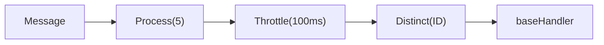

# Composing Middleware

goflux middleware wraps a `Handler[T]` to add cross-cutting behaviour. The `Middleware[T]` type is a function that takes a handler and returns a new handler:

```go
type Middleware[T any] func(Handler[T]) Handler[T]
```

`Chain` composes multiple middleware left-to-right. The first middleware in the list is the outermost wrapper.

## Chain Execution Order

`Chain(a, b)(handler)` is equivalent to `a(b(handler))`. The outermost middleware runs first on the way in, and last on the way out.

```go
package main

import (
	"context"
	"fmt"

	"github.com/foomo/goflux"
)

type Event struct {
	ID   string
	Name string
}

func main() {
	var trace []string

	mwA := func(next goflux.Handler[Event]) goflux.Handler[Event] {
		return func(ctx context.Context, msg goflux.Message[Event]) error {
			trace = append(trace, "A-before")
			err := next(ctx, msg)
			trace = append(trace, "A-after")
			return err
		}
	}

	mwB := func(next goflux.Handler[Event]) goflux.Handler[Event] {
		return func(ctx context.Context, msg goflux.Message[Event]) error {
			trace = append(trace, "B-before")
			err := next(ctx, msg)
			trace = append(trace, "B-after")
			return err
		}
	}

	base := func(_ context.Context, msg goflux.Message[Event]) error {
		trace = append(trace, "handler:"+msg.Payload.Name)
		return nil
	}

	handler := goflux.Chain[Event](mwA, mwB)(base)

	_ = handler(context.Background(), goflux.NewMessage("events", Event{ID: "1", Name: "hello"}))

	for _, s := range trace {
		fmt.Println(s)
	}
	// Output:
	// A-before
	// B-before
	// handler:hello
	// B-after
	// A-after
}
```

## Built-in Middleware

### Distinct -- Deduplicate by Key

`Distinct` drops messages whose key has already been seen. The key function extracts a string identifier from each message.

```go
package main

import (
	"context"
	"fmt"

	"github.com/foomo/goflux"
)

type Event struct {
	ID   string
	Name string
}

func main() {
	var received []string

	handler := goflux.Chain[Event](
		goflux.Distinct[Event](func(msg goflux.Message[Event]) string {
			return msg.Payload.ID
		}),
	)(func(_ context.Context, msg goflux.Message[Event]) error {
		received = append(received, msg.Payload.Name)
		return nil
	})

	ctx := context.Background()
	_ = handler(ctx, goflux.NewMessage("events", Event{ID: "1", Name: "first"}))
	_ = handler(ctx, goflux.NewMessage("events", Event{ID: "1", Name: "duplicate"}))
	_ = handler(ctx, goflux.NewMessage("events", Event{ID: "2", Name: "second"}))

	for _, r := range received {
		fmt.Println(r)
	}
	// Output:
	// first
	// second
}
```

The second message with ID `"1"` is silently dropped.

### Throttle -- Rate Limiting

`Throttle` enforces a minimum interval between handler calls. If a message arrives before the interval has elapsed, the call blocks until the interval passes.

```go
package main

import (
	"context"
	"fmt"
	"time"

	"github.com/foomo/goflux"
)

type Event struct {
	ID   string
	Name string
}

func main() {
	var received []string

	handler := goflux.Chain[Event](
		goflux.Throttle[Event](50 * time.Millisecond),
	)(func(_ context.Context, msg goflux.Message[Event]) error {
		received = append(received, msg.Payload.Name)
		return nil
	})

	ctx := context.Background()
	start := time.Now()

	_ = handler(ctx, goflux.NewMessage("events", Event{ID: "1", Name: "first"}))
	_ = handler(ctx, goflux.NewMessage("events", Event{ID: "2", Name: "second"}))

	elapsed := time.Since(start)

	fmt.Println("messages:", received)
	fmt.Println("waited:", elapsed >= 50*time.Millisecond)
	// Output:
	// messages: [first second]
	// waited: true
}
```

Both messages are delivered, but the second one is delayed to respect the rate limit.

### Process -- Concurrency Limit

`Process` limits the number of concurrent handler invocations using a semaphore. Calls beyond the limit block until a slot is available.

```go
package main

import (
	"context"
	"fmt"
	"sync"
	"sync/atomic"

	"github.com/foomo/goflux"
)

type Event struct {
	ID   string
	Name string
}

func main() {
	var (
		maxConcurrent atomic.Int64
		current       atomic.Int64
		mu            sync.Mutex
		received      []string
		wg            sync.WaitGroup
	)

	handler := goflux.Chain[Event](
		goflux.Process[Event](2), // at most 2 concurrent handlers
	)(func(_ context.Context, msg goflux.Message[Event]) error {
		cur := current.Add(1)
		defer current.Add(-1)

		for {
			old := maxConcurrent.Load()
			if cur <= old || maxConcurrent.CompareAndSwap(old, cur) {
				break
			}
		}

		mu.Lock()
		received = append(received, msg.Payload.Name)
		mu.Unlock()

		return nil
	})

	ctx := context.Background()

	for i := range 5 {
		wg.Go(func() {
			_ = handler(ctx, goflux.NewMessage("events", Event{
				ID:   fmt.Sprintf("%d", i),
				Name: fmt.Sprintf("msg-%d", i),
			}))
		})
	}

	wg.Wait()

	fmt.Println("count:", len(received))
	fmt.Println("max concurrent <= 2:", maxConcurrent.Load() <= 2)
	// Output:
	// count: 5
	// max concurrent <= 2: true
}
```

### Peek -- Side-Effect Observation

`Peek` calls a function for every message without modifying it. Useful for logging, metrics, or debugging.

```go
package main

import (
	"context"
	"fmt"

	"github.com/foomo/goflux"
)

type Event struct {
	ID   string
	Name string
}

func main() {
	var (
		peeked  []string
		handled []string
	)

	handler := goflux.Chain[Event](
		goflux.Peek[Event](func(_ context.Context, msg goflux.Message[Event]) {
			peeked = append(peeked, "peek:"+msg.Payload.Name)
		}),
	)(func(_ context.Context, msg goflux.Message[Event]) error {
		handled = append(handled, "handle:"+msg.Payload.Name)
		return nil
	})

	ctx := context.Background()
	_ = handler(ctx, goflux.NewMessage("events", Event{ID: "1", Name: "hello"}))

	fmt.Println(peeked)
	fmt.Println(handled)
	// Output:
	// [peek:hello]
	// [handle:hello]
}
```

### Skip -- Drop Leading Messages

`Skip` drops the first N messages and passes all subsequent messages through.

```go
package main

import (
	"context"
	"fmt"

	"github.com/foomo/goflux"
)

type Event struct {
	ID   string
	Name string
}

func main() {
	var received []string

	handler := goflux.Chain[Event](
		goflux.Skip[Event](2),
	)(func(_ context.Context, msg goflux.Message[Event]) error {
		received = append(received, msg.Payload.Name)
		return nil
	})

	ctx := context.Background()
	_ = handler(ctx, goflux.NewMessage("events", Event{ID: "1", Name: "first"}))
	_ = handler(ctx, goflux.NewMessage("events", Event{ID: "2", Name: "second"}))
	_ = handler(ctx, goflux.NewMessage("events", Event{ID: "3", Name: "third"}))
	_ = handler(ctx, goflux.NewMessage("events", Event{ID: "4", Name: "fourth"}))

	for _, r := range received {
		fmt.Println(r)
	}
	// Output:
	// third
	// fourth
}
```

### Take -- Limit Total Messages

`Take` passes only the first N messages and silently drops everything after.

```go
package main

import (
	"context"
	"fmt"

	"github.com/foomo/goflux"
)

type Event struct {
	ID   string
	Name string
}

func main() {
	var received []string

	handler := goflux.Chain[Event](
		goflux.Take[Event](2),
	)(func(_ context.Context, msg goflux.Message[Event]) error {
		received = append(received, msg.Payload.Name)
		return nil
	})

	ctx := context.Background()
	_ = handler(ctx, goflux.NewMessage("events", Event{ID: "1", Name: "first"}))
	_ = handler(ctx, goflux.NewMessage("events", Event{ID: "2", Name: "second"}))
	_ = handler(ctx, goflux.NewMessage("events", Event{ID: "3", Name: "third"}))

	for _, r := range received {
		fmt.Println(r)
	}
	// Output:
	// first
	// second
}
```

## Practical Composition

Middleware shines when composed together. The order matters -- middleware listed first in `Chain` is the outermost wrapper.

```go
// Limit to 5 concurrent handlers, enforce a 100ms rate limit,
// and deduplicate by event ID.
handler := goflux.Chain[Event](
	goflux.Process[Event](5),
	goflux.Throttle[Event](100 * time.Millisecond),
	goflux.Distinct[Event](func(msg goflux.Message[Event]) string {
		return msg.Payload.ID
	}),
)(baseHandler)
```

Execution order for each message:

1. `Process` -- acquire semaphore slot (blocks if 5 handlers are active)
2. `Throttle` -- wait if less than 100ms since the last call
3. `Distinct` -- drop if this ID was already seen
4. `baseHandler` -- process the message



### Using Middleware with Subscribe

Middleware composes with any `Handler[T]`, including pipe handlers:

```go
// Apply middleware to a handler used with Subscribe.
base := func(ctx context.Context, msg goflux.Message[Event]) error {
	fmt.Println("processing:", msg.Payload.Name)
	return nil
}

wrapped := goflux.Chain[Event](
	goflux.Process[Event](10),
	goflux.Distinct[Event](func(msg goflux.Message[Event]) string {
		return msg.Payload.ID
	}),
)(base)

go func() {
	_ = sub.Subscribe(ctx, "events", wrapped)
}()
```

Middleware also works with `Pipe` and `PipeMap` -- wrap the returned handler before passing it to `Subscribe`:

```go
pipe := goflux.Pipe[Event](dstPub)

wrapped := goflux.Chain[Event](
	goflux.Throttle[Event](50 * time.Millisecond),
)(pipe)

go func() {
	_ = srcSub.Subscribe(ctx, "events", wrapped)
}()
```

## Summary

| Middleware | Effect |
|-----------|--------|
| `Distinct(keyFn)` | Drop messages with a previously seen key |
| `Throttle(interval)` | Enforce minimum interval between calls |
| `Process(n)` | Limit to N concurrent handler invocations |
| `Peek(fn)` | Observe messages without modifying them |
| `Skip(n)` | Drop the first N messages |
| `Take(n)` | Pass only the first N messages |
