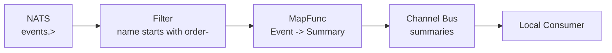

# NATS Pipeline

The `nats/` transport publishes and subscribes over [NATS](https://nats.io) core. Messages are serialized with a codec (typically JSON) and delivered over the network.

::: warning
A running NATS server is required. The examples below connect to `nats://localhost:4222` by default.
:::

## Basic NATS Pub/Sub

```go
package main

import (
	"context"
	"fmt"
	"time"

	"github.com/foomo/goencode/json/v1"
	"github.com/foomo/goflux"
	gofluxnats "github.com/foomo/goflux/nats"
	"github.com/nats-io/nats.go"
)

type Event struct {
	ID   string `json:"id"`
	Name string `json:"name"`
}

func main() {
	// Connect to NATS.
	conn, err := nats.Connect(nats.DefaultURL) // nats://localhost:4222
	if err != nil {
		panic(err)
	}
	defer conn.Drain()

	ctx, cancel := context.WithCancel(context.Background())
	defer cancel()

	codec := json.NewCodec[Event]()

	// Create publisher and subscriber sharing the same connection.
	pub := gofluxnats.NewPublisher[Event](conn, codec)
	sub := gofluxnats.NewSubscriber[Event](conn, codec)

	done := make(chan struct{})

	// Subscribe blocks — run in a goroutine.
	go func() {
		_ = sub.Subscribe(ctx, "events.user", func(_ context.Context, msg goflux.Message[Event]) error {
			fmt.Println(msg.Subject, msg.Payload)
			close(done)
			return nil
		})
	}()

	// Allow subscription to register.
	time.Sleep(50 * time.Millisecond)

	if err := pub.Publish(ctx, "events.user", Event{ID: "1", Name: "alice"}); err != nil {
		panic(err)
	}

	<-done
	// Output: events.user {1 alice}
}
```

Key points:

- The caller owns the `*nats.Conn` -- goflux does not connect or close it. Call `conn.Drain()` yourself.
- Each message is handled in the NATS callback goroutine. Keep handlers fast to avoid blocking the subscription.
- NATS core has no ack/nack or persistence. For at-least-once delivery, a JetStream transport is planned.

## Pipeline: NATS to Channel with Filtering

A common pattern is receiving events from NATS, filtering and transforming them, then publishing to an in-process bus for local consumers.

```go
package main

import (
	"context"
	"fmt"
	"time"

	"github.com/foomo/goencode/json/v1"
	"github.com/foomo/goflux"
	_chan "github.com/foomo/goflux/chan"
	gofluxnats "github.com/foomo/goflux/nats"
	"github.com/nats-io/nats.go"
)

type Event struct {
	ID   string `json:"id"`
	Name string `json:"name"`
}

type Summary struct {
	Label string
}

func main() {
	// --- NATS source ---
	conn, err := nats.Connect(nats.DefaultURL)
	if err != nil {
		panic(err)
	}
	defer conn.Drain()

	ctx, cancel := context.WithCancel(context.Background())
	defer cancel()

	codec := json.NewCodec[Event]()
	natsSub := gofluxnats.NewSubscriber[Event](conn, codec)

	// --- Channel destination ---
	dstBus := _chan.NewBus[Summary]()
	dstPub := _chan.NewPublisher(dstBus)

	dstSub, err := _chan.NewSubscriber(dstBus, 10)
	if err != nil {
		panic(err)
	}

	done := make(chan struct{})

	// Local consumer.
	go func() {
		_ = dstSub.Subscribe(ctx, "summaries", func(_ context.Context, msg goflux.Message[Summary]) error {
			fmt.Println(msg.Payload)
			close(done)
			return nil
		})
	}()

	// Filter: only pass events with Name starting with "order-".
	filter := func(_ context.Context, msg goflux.Message[Event]) (bool, error) {
		return len(msg.Payload.Name) > 6 && msg.Payload.Name[:6] == "order-", nil
	}

	// Map: Event -> Summary.
	mapFn := func(_ context.Context, msg goflux.Message[Event]) (goflux.Message[Summary], error) {
		return goflux.NewMessage("summaries", Summary{Label: msg.Payload.Name}), nil
	}

	// Wire the pipeline: NATS -> filter -> map -> channel bus.
	go func() {
		_ = natsSub.Subscribe(ctx, "events.>",
			goflux.PipeMap[Event, Summary](dstPub, mapFn,
				goflux.WithFilter[Event](filter),
			),
		)
	}()

	time.Sleep(50 * time.Millisecond)

	// Publish to NATS — only the second message passes the filter.
	natsPub := gofluxnats.NewPublisher[Event](conn, codec)

	_ = natsPub.Publish(ctx, "events.user", Event{ID: "1", Name: "login"})
	_ = natsPub.Publish(ctx, "events.order", Event{ID: "2", Name: "order-42"})

	<-done
	// Output: {order-42}
}
```



## Connection Setup Patterns

### Single connection, multiple publishers/subscribers

All goflux NATS publishers and subscribers can share a single `*nats.Conn`:

```go
conn, _ := nats.Connect(nats.DefaultURL)
defer conn.Drain()

codec := json.NewCodec[Event]()

pub1 := gofluxnats.NewPublisher[Event](conn, codec)
pub2 := gofluxnats.NewPublisher[Event](conn, codec)
sub1 := gofluxnats.NewSubscriber[Event](conn, codec)
```

### Connection options

Pass standard NATS options to `nats.Connect`:

```go
conn, _ := nats.Connect(
	nats.DefaultURL,
	nats.MaxReconnects(10),
	nats.ReconnectWait(2*time.Second),
	nats.DisconnectErrHandler(func(_ *nats.Conn, err error) {
		log.Printf("NATS disconnected: %v", err)
	}),
)
```
