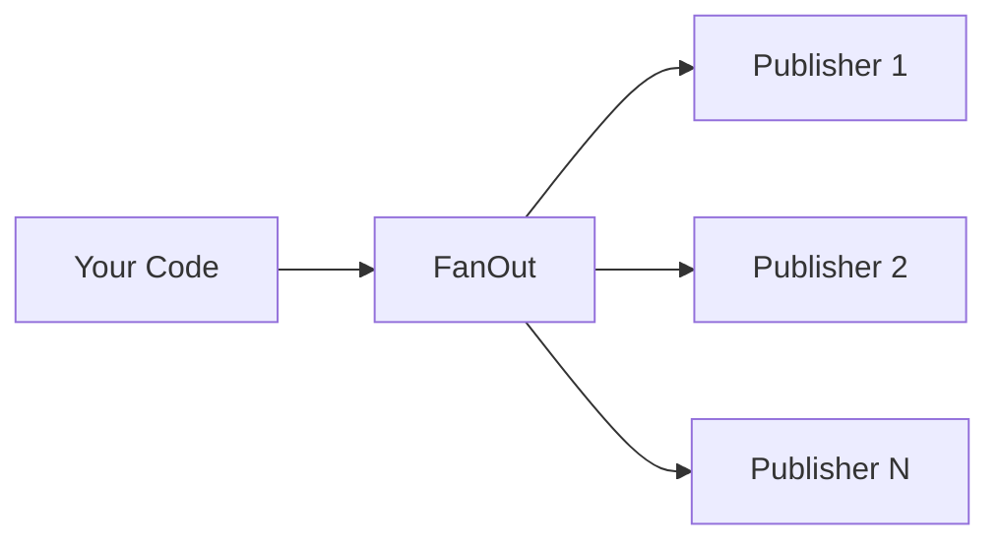
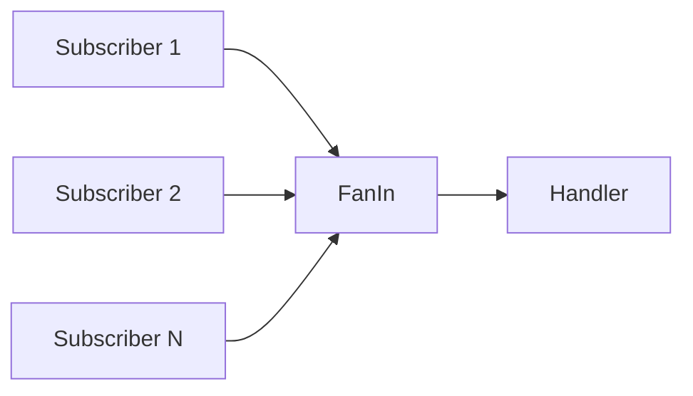
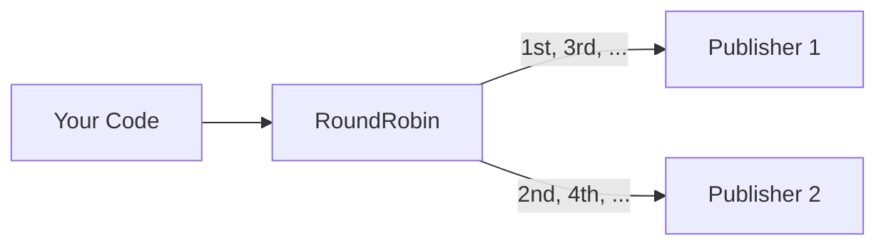

# Distribution

goflux provides three distribution operators for routing messages across multiple publishers or merging multiple subscribers.

## FanOut[T]

`FanOut` returns a `Publisher[T]` that broadcasts every `Publish` call to all inner publishers.

```go
func FanOut[T any](publishers []Publisher[T], opts ...FanOutOption[T]) Publisher[T]
```



### Default: Best-Effort

By default, FanOut publishes to every inner publisher. If some fail, the errors are joined via `errors.Join` and returned. Publishers that succeed are not affected by failures of others.

```go
import "github.com/foomo/goflux"

pub := goflux.FanOut([]goflux.Publisher[OrderEvent]{pub1, pub2, pub3})

// Publishes to all three. If pub2 fails, pub1 and pub3 still receive the message.
err := pub.Publish(ctx, "orders", event)
// err contains pub2's error (via errors.Join)
```

### All-or-Nothing

With `WithFanOutAllOrNothing`, the first error aborts the entire operation. Publishers after the failing one do not receive the message.

```go
pub := goflux.FanOut([]goflux.Publisher[OrderEvent]{pub1, pub2, pub3},
    goflux.WithFanOutAllOrNothing[OrderEvent](),
)

// If pub1 fails, pub2 and pub3 are not called.
err := pub.Publish(ctx, "orders", event)
```

### Close Behaviour

`Close()` on a FanOut publisher is a **no-op**. The caller owns the inner publishers and is responsible for closing them.

## FanIn[T]

`FanIn` returns a `Subscriber[T]` that subscribes to the same subject on all provided subscribers and dispatches every message to a single handler.

```go
func FanIn[T any](subscribers ...Subscriber[T]) Subscriber[T]
```



### Usage

```go
import "github.com/foomo/goflux"

merged := goflux.FanIn(sub1, sub2, sub3)

// Subscribes to "orders" on all three subscribers.
// Every message from any subscriber is dispatched to the handler.
go func() {
    _ = merged.Subscribe(ctx, "orders", handler)
}()
```

`Subscribe` launches a goroutine per inner subscriber and blocks until **all** inner subscriptions complete (i.e. all contexts are cancelled or all return an error). A `sync.WaitGroup` coordinates the wait.

### Close Behaviour

`Close()` on a FanIn subscriber is a **no-op**. The caller owns the inner subscribers and is responsible for closing them.

## RoundRobin[T]

`RoundRobin` returns a `Publisher[T]` that distributes each `Publish` call to a single inner publisher, cycling through them in order.

```go
func RoundRobin[T any](publishers ...Publisher[T]) Publisher[T]
```



### Usage

```go
import "github.com/foomo/goflux"

pub := goflux.RoundRobin(pub1, pub2, pub3)

pub.Publish(ctx, "orders", event1) // -> pub1
pub.Publish(ctx, "orders", event2) // -> pub2
pub.Publish(ctx, "orders", event3) // -> pub3
pub.Publish(ctx, "orders", event4) // -> pub1 (wraps around)
```

The index is tracked with an `atomic.Uint64` counter, making it safe for concurrent use. Each call increments the counter and selects `publishers[counter % len(publishers)]`.

### Close Behaviour

`Close()` on a RoundRobin publisher is a **no-op**. The caller owns the inner publishers and is responsible for closing them.

## Combining Distribution with Pipelines

Distribution operators compose naturally with [pipelines](./pipelines.md) and [middleware](./middleware.md):

```go
// Fan-out: publish to both NATS and a local audit log.
fanout := goflux.FanOut([]goflux.Publisher[OrderEvent]{natsPub, auditPub})

// Pipe with filter through the fan-out publisher.
filter := func(_ context.Context, msg goflux.Message[OrderEvent]) (bool, error) {
    return msg.Payload.Status == "confirmed", nil
}

go func() {
    _ = sub.Subscribe(ctx, "orders",
        goflux.Pipe[OrderEvent](fanout, goflux.WithFilter[OrderEvent](filter)),
    )
}()
```

```go
// Fan-in: merge messages from two NATS clusters, with concurrency limiting.
merged := goflux.FanIn(natsSubCluster1, natsSubCluster2)

handler := goflux.Chain[OrderEvent](
    goflux.Process[OrderEvent](10),
)(processOrder)

go func() {
    _ = merged.Subscribe(ctx, "orders", handler)
}()
```

## What's Next

- [Pipelines](./pipelines.md) -- filter and transform messages between publishers
- [Middleware](./middleware.md) -- add concurrency limiting, deduplication, and rate limiting
- [Telemetry](./telemetry.md) -- monitor distribution with traces and metrics
