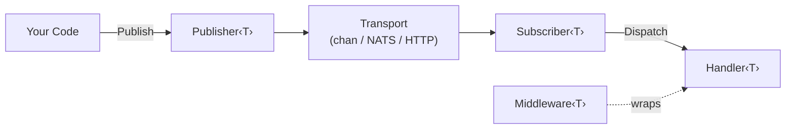

# Introduction

## What is goflux?

goflux is a generic, transport-agnostic pub/sub messaging library for Go. It is part of the [foomo](https://github.com/foomo) ecosystem and designed for microservices running on Kubernetes.

The library provides a thin, composable layer over message transports -- Go channels, NATS, and HTTP -- so that business logic handlers are written once against stable interfaces and transports can be swapped without touching handler code.

## Design Philosophy

- **Interfaces over implementations** -- `Publisher[T]` and `Subscriber[T]` are small interfaces. Transports implement them; your code depends only on the interfaces.
- **Generics for type safety** -- every message is `Message[T]`, fully decoded at the transport boundary. No raw bytes leak into handler code.
- **Composition over configuration** -- pipelines, middleware, fan-out, and fan-in are plain functions that compose with each other. There is no framework to configure.
- **Telemetry by default** -- OpenTelemetry tracing and metrics are built into every transport. No opt-in required.

## Architecture



A **Publisher** serialises and sends messages. A **Subscriber** receives messages, decodes them, and dispatches them to a **Handler**. **Middleware** wraps handlers to add cross-cutting behaviour such as concurrency limiting, deduplication, or rate limiting. The transport layer is the only part that changes when you switch from in-process channels to NATS or HTTP.

## When to Use goflux

- You need to **decouple producers and consumers** within or across services.
- You want to **swap transports** (e.g. channels in tests, NATS in production) without rewriting business logic.
- You want **built-in observability** -- every publish and process operation is traced and metered automatically.
- You prefer **type-safe messaging** over untyped byte slices.

## Package Overview

| Package | Import | Purpose |
|---------|--------|---------|
| `goflux` | `github.com/foomo/goflux` | Core interfaces, pipeline helpers, middleware, distribution operators |
| `chan` | `github.com/foomo/goflux/chan` | In-process channel transport (no codec, backpressure) |
| `nats` | `github.com/foomo/goflux/nats` | NATS core transport |
| `http` | `github.com/foomo/goflux/http` | HTTP POST transport |
| `testing` | `github.com/foomo/goflux/testing` | Test helpers (`GoAsync`, `GoSync`) |

::: tip
The `chan` package uses Go's reserved word as its directory name. Import it with an alias:

```go
import _chan "github.com/foomo/goflux/chan"
```
:::

## What's Next

- [Getting Started](./getting-started.md) -- install goflux and run your first example
- [Core Concepts](./core-concepts.md) -- learn the fundamental types and rules
- [Transports](./transports.md) -- choose and configure a transport
