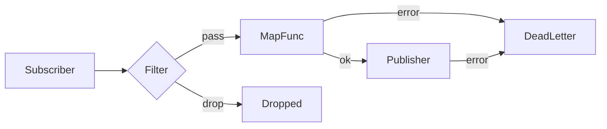

# Pipelines

Pipelines wire a subscriber to a publisher, optionally filtering and transforming messages along the way. The pipeline helpers return a `Handler[T]` -- they do not manage lifecycle or own any resources.

## Overview



## Pipe[T]

`Pipe` returns a `Handler[T]` that forwards every accepted message to a publisher. Filters run first; a dropped message never reaches the publisher.

```go
func Pipe[T any](pub Publisher[T], opts ...PipeOption[T]) Handler[T]
```

### Basic Pipe

```go
import (
    "github.com/foomo/goflux"
    _chan "github.com/foomo/goflux/chan"
)

srcBus := _chan.NewBus[OrderEvent]()
srcSub, _ := _chan.NewSubscriber(srcBus, 8)

dstBus := _chan.NewBus[OrderEvent]()
dstPub := _chan.NewPublisher(dstBus)

// Every message received on "orders" is forwarded to dstPub.
go func() {
    _ = srcSub.Subscribe(ctx, "orders", goflux.Pipe[OrderEvent](dstPub))
}()
```

Publish errors are returned to the subscriber as-is. Wrap the publisher with a retry decorator to add backoff before the error surfaces.

## PipeMap[T, U]

`PipeMap` returns a `Handler[T]` that maps each `Message[T]` to a `Message[U]` before publishing. Filters run on the source type `T` before the map function executes.

```go
func PipeMap[T, U any](pub Publisher[U], mapFn MapFunc[T, U], opts ...PipeOption[T]) Handler[T]
```

### Type-Changing Pipe

```go
type OrderEvent struct {
    ID   string
    Name string
}

type OrderSummary struct {
    Label string
}

mapFn := func(_ context.Context, msg goflux.Message[OrderEvent]) (goflux.Message[OrderSummary], error) {
    return goflux.NewMessage(msg.Subject, OrderSummary{
        Label: msg.Payload.Name,
    }), nil
}

summaryPub := _chan.NewPublisher(summaryBus)

go func() {
    _ = srcSub.Subscribe(ctx, "orders",
        goflux.PipeMap[OrderEvent, OrderSummary](summaryPub, mapFn),
    )
}()
```

A map error drops the message (it is non-fatal to the subscriber) and routes the original `Message[T]` to the dead-letter handler if one is set.

## Filter[T]

A filter is a predicate that decides whether a message should be forwarded:

```go
type Filter[T any] func(ctx context.Context, msg Message[T]) (bool, error)
```

- Returning `false` drops the message (logged at debug level).
- Returning a non-nil error drops the message (logged at warn level).

Filters are registered via `WithFilter`:

```go
func WithFilter[T any](f Filter[T]) PipeOption[T]
```

Multiple filters can be added by calling `WithFilter` multiple times. They are evaluated in order; the first `false` or error short-circuits.

### Pipe with Filter

```go
// Drop events with ID "skip".
filter := func(_ context.Context, msg goflux.Message[OrderEvent]) (bool, error) {
    return msg.Payload.ID != "skip", nil
}

go func() {
    _ = srcSub.Subscribe(ctx, "orders",
        goflux.Pipe[OrderEvent](dstPub, goflux.WithFilter[OrderEvent](filter)),
    )
}()
```

## MapFunc[T, U]

A map function transforms a message from one type to another:

```go
type MapFunc[T, U any] func(ctx context.Context, msg Message[T]) (Message[U], error)
```

- Returning a non-nil error drops the message and routes it to the dead-letter handler if set.
- The returned `Message[U]` carries its own subject, so you can remap subjects during transformation.

## DeadLetterFunc[T]

A dead-letter handler receives messages that could not be mapped or published:

```go
type DeadLetterFunc[T any] func(ctx context.Context, msg Message[T], err error)
```

Register it with `WithDeadLetter`:

```go
func WithDeadLetter[T any](fn DeadLetterFunc[T]) PipeOption[T]
```

### PipeMap with Filter and Dead Letter

```go
mapFn := func(_ context.Context, msg goflux.Message[OrderEvent]) (goflux.Message[OrderSummary], error) {
    if msg.Payload.ID == "" {
        return goflux.Message[OrderSummary]{}, fmt.Errorf("missing order ID")
    }
    return goflux.NewMessage(msg.Subject, OrderSummary{Label: msg.Payload.Name}), nil
}

filter := func(_ context.Context, msg goflux.Message[OrderEvent]) (bool, error) {
    return msg.Payload.Name != "", nil
}

deadLetter := func(_ context.Context, msg goflux.Message[OrderEvent], err error) {
    log.Printf("dead-letter: subject=%s err=%v", msg.Subject, err)
}

go func() {
    _ = srcSub.Subscribe(ctx, "orders",
        goflux.PipeMap[OrderEvent, OrderSummary](summaryPub, mapFn,
            goflux.WithFilter[OrderEvent](filter),
            goflux.WithDeadLetter[OrderEvent](deadLetter),
        ),
    )
}()
```

## Error Handling Summary

| Stage | Error | Action |
|-------|-------|--------|
| Filter | returns `false` | Drop message, log at debug level |
| Filter | returns error | Drop message, log at warn level |
| MapFunc | returns error | Drop message, log at error level, call dead-letter if set |
| Publish | returns error | Call dead-letter if set, return error to subscriber |

## What's Next

- [Middleware](./middleware.md) -- wrap handlers with concurrency limiting, deduplication, and more
- [Distribution](./distribution.md) -- fan-out, fan-in, and round-robin patterns
- [Telemetry](./telemetry.md) -- understand the metrics produced by pipelines
